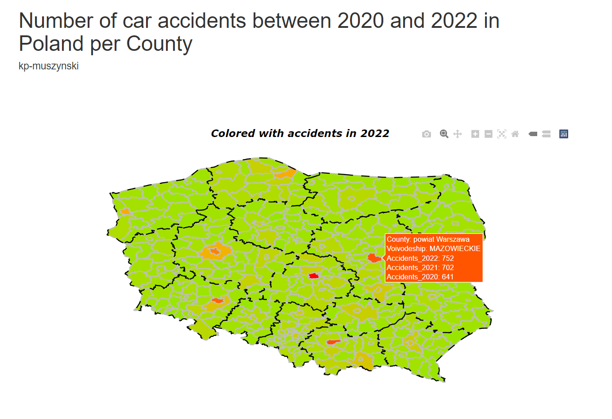

# Country-Map

The purpose of this mini project was to create an interactive map of Poland per County (Powiat), filled with additional information. For that I chose number of car accidents between 2020 and 2022. The code was written in RStudio and saved to .Rmd file.

## Input files
The shapefiles with borders per County, Voivodeship (Województwo) and more are available for free on the official government [website](https://www.geoportal.gov.pl/dane/panstwowy-rejestr-granic).
I used 2022 package, which is stored in the repository (under *PRG_jednostki_administracyjne_2022*) for County and Voivodeship. The latter helps to make the map more transparent and show the division to Voivodeships. 

The car accidents came from the Central Statistical Office's (GUS) [database](https://bdl.stat.gov.pl/bdl/metadane/cechy/3884). I saved the data to a txt file (*Wypadki.txt*) and added code of the County, together with Voivodeship, to be able to join relevant information to the shapefile.

## Code
To set working directory automatically (to directory of the *country_map.Rmd* script) on my local computer, I used:
```
setwd(dirname(rstudioapi::getSourceEditorContext()$path))
```
To plot the map, I decided to go with ggplot2 package with geom_polygon and geom_path (for the Voivodeships). The fill is based on number of accidents in 2022.
As there is a gap between Counties with little and many incidents, I defined an arbitrary midpoint:
```
scale_fill_gradient2(low = "green",mid="orange", high="red", limits=c(a,b), midpoint=375)
```
At the end, the ggplotly function tranforms the plot, so that the user can utilize plotly functionalities, including zooming and the information provided in the  tooltip.

Knitting to HTML produced *country_map.html* file, that is also provided in the repository.


